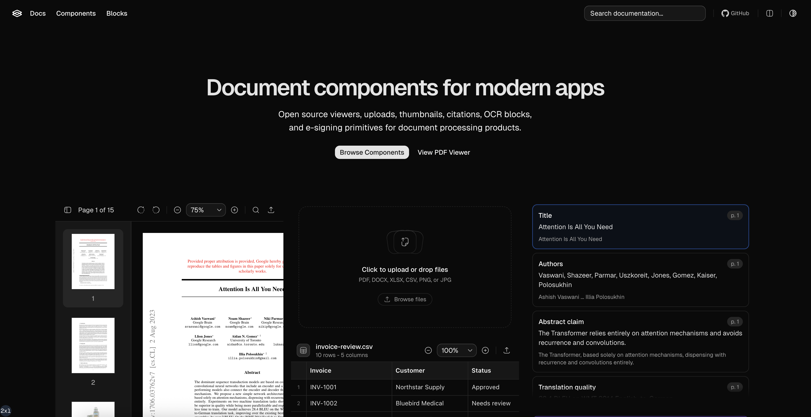

# Extend UI

Open source document components created by [Extend](https://www.extend.ai).
Extend UI gives product teams the building blocks for document processing
interfaces: PDF viewers, file uploads, thumbnails, citations, OCR blocks,
human review, document splitting, and e-signature flows.



## Links

- Documentation: `http://localhost:4000`
- GitHub: [extend-hq/ui](https://github.com/extend-hq/ui)

## Development

```bash
pnpm install
pnpm v4:dev
```

The site runs at `http://localhost:4000`.

## Included Sections

- Docs
- Components
- Blocks
- PDF Viewer blocks

## Created By

Extend UI is built and maintained by [Extend](https://www.extend.ai) for teams
building modern document processing products.

## License

Licensed under the [MIT license](./LICENSE.md).
